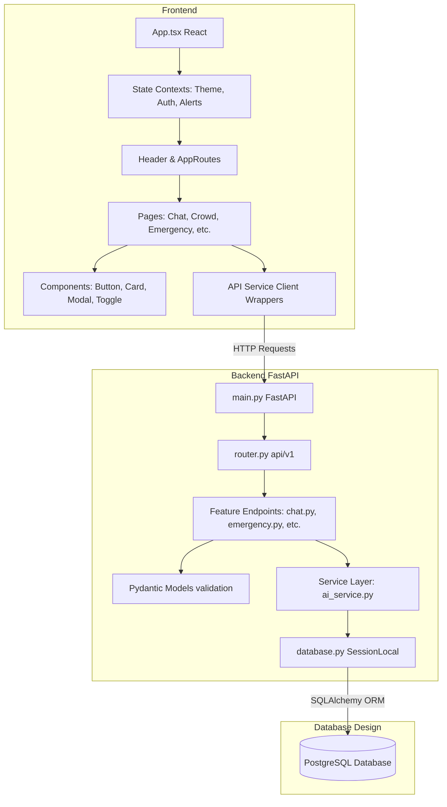

# StadiumMind AI — Architecture Specification & Setup Guide

StadiumMind AI is a production-ready, clean-architecture full-stack operations and fan assistance platform. It scales dynamically to support operations like the FIFA World Cup 2026, combining AI-driven spectator assistance with live venue telemetry.

---

## 1. Professional Folder Hierarchy

The repository is divided into decoupled frontend and backend scopes matching Clean Architecture conventions:

```text
stadiummind-ai/
├── backend/
│   ├── app/
│   │   ├── core/                    # Security, Database engine, Environment settings
│   │   │   ├── config.py
│   │   │   └── database.py
│   │   ├── models/                  # SQLAlchemy PostgreSQL model mappings
│   │   │   └── stadium.py
│   │   ├── schemas/                 # Pydantic validation request/response models
│   │   │   └── stadium.py
│   │   ├── services/                # Business logic, RAG contexts, ML queue wrappers
│   │   │   └── ai_service.py
│   │   ├── api/
│   │   │   └── v1/                  # Router layers & v1 endpoints
│   │   │       ├── endpoints/
│   │   │       │   ├── chat.py
│   │   │       │   ├── crowd.py
│   │   │       │   ├── navigation.py
│   │   │       │   ├── queue.py
│   │   │       │   ├── volunteer.py
│   │   │       │   ├── admin.py
│   │   │       │   ├── accessibility.py
│   │   │       │   ├── sustainability.py
│   │   │       │   └── emergency.py
│   │   │       └── router.py
│   │   └── main.py                  # FastAPI Application Bootstrap
│   └── requirements.txt
│
├── frontend/
│   ├── src/
│   │   ├── store/                   # Global React State Providers (Contexts)
│   │   │   ├── ThemeContext.tsx
│   │   │   ├── AuthContext.tsx
│   │   │   └── AlertContext.tsx
│   │   ├── components/              # Shared layout & reusable UI widgets
│   │   │   ├── ui/
│   │   │   │   ├── Button.tsx
│   │   │   │   ├── Card.tsx
│   │   │   │   ├── Input.tsx
│   │   │   │   ├── Modal.tsx
│   │   │   │   └── ThemeToggle.tsx
│   │   │   └── layout/
│   │   │       └── Header.tsx
│   │   ├── services/                # API client & feature service wrappers
│   │   │   ├── apiClient.ts
│   │   │   ├── chatService.ts
│   │   │   ├── crowdService.ts
│   │   │   ├── navigationService.ts
│   │   │   ├── queueService.ts
│   │   │   ├── volunteerService.ts
│   │   │   ├── adminService.ts
│   │   │   ├── accessibilityService.ts
│   │   │   ├── sustainabilityService.ts
│   │   │   └── emergencyService.ts
│   │   ├── routes/                  # React Router layouts and routes definitions
│   │   │   └── AppRoutes.tsx
│   │   ├── pages/                   # Component views for all 9 systems
│   │   │   ├── Home.tsx
│   │   │   ├── About.tsx
│   │   │   ├── Chat.tsx
│   │   │   ├── Crowd.tsx
│   │   │   ├── Navigation.tsx
│   │   │   ├── Queue.tsx
│   │   │   ├── Volunteer.tsx
│   │   │   ├── Admin.tsx
│   │   │   ├── Accessibility.tsx
│   │   │   ├── Sustainability.tsx
│   │   │   └── Emergency.tsx
│   │   ├── App.tsx                  # Root state injector & router layout mount
│   │   ├── main.tsx
│   │   └── index.css
│   ├── package.json
│   ├── tailwind.config.cjs
│   └── postcss.config.cjs
└── README.md                        # This document
```

---

## 2. Clean Full-Stack System Architecture

The following diagram details the transaction flow from the spectator UI, down through the service logic interfaces and PostgreSQL database layers:



---

## 3. PostgreSQL Database Design (Logical Schema)

For production, the storage schema is optimized with indexes, relational foreign keys, and status enum constraints:

| Table Name | Column | Type | Constraints | Description |
| :--- | :--- | :--- | :--- | :--- |
| **users** | `id` | `VARCHAR` | Primary Key, Indexed | Unique identifier |
| | `name` | `VARCHAR` | Not Null | Display name |
| | `email` | `VARCHAR` | Unique, Indexed, Not Null | Account credentials |
| | `role` | `VARCHAR` | Default: `'user'` | Role control: `'user'`, `'volunteer'`, `'admin'` |
| | `hashed_password` | `VARCHAR` | Not Null | Hashed credentials |
| | `created_at` | `TIMESTAMP` | Default: `now()` | Registration date |
| **pois** | `id` | `VARCHAR` | Primary Key, Indexed | Point of interest ID (e.g. `gate_1`) |
| | `name` | `VARCHAR` | Not Null | Landmark label |
| | `type` | `VARCHAR` | Not Null | Category: `'gate'`, `'concession'`, `'restroom'` |
| | `lat` | `DOUBLE PRECISION` | Not Null | Latitude coordinate |
| | `lng` | `DOUBLE PRECISION` | Not Null | Longitude coordinate |
| | `level` | `INTEGER` | Default: `1` | Stadium level/floor |
| | `is_accessible` | `BOOLEAN` | Default: `TRUE` | Step-free or ramp access status |
| | `status` | `VARCHAR` | Default: `'open'` | Operating status: `'open'`, `'closed'`, `'busy'` |
| **queue_metrics** | `id` | `SERIAL` | Primary Key | Auto-incrementing log ID |
| | `poi_id` | `VARCHAR` | Foreign Key (pois.id) | Linked stand or entrance |
| | `wait_minutes` | `INTEGER` | Not Null | Live estimated wait |
| | `predicted_15min` | `INTEGER` | Not Null | Forecast wait in 15 mins |
| | `predicted_30min` | `INTEGER` | Not Null | Forecast wait in 30 mins |
| | `trend` | `VARCHAR` | Default: `'stable'` | Rate of queue change: `'rising'`, `'stable'`, `'falling'` |
| | `timestamp` | `TIMESTAMP` | Default: `now()` | Measurement time |
| **volunteer_tasks** | `id` | `VARCHAR` | Primary Key, Indexed | Job ticket identifier |
| | `title` | `VARCHAR` | Not Null | Short job title |
| | `description` | `TEXT` | Not Null | Full job instructions |
| | `location_name` | `VARCHAR` | Not Null | Concourse zone |
| | `priority` | `VARCHAR` | Default: `'medium'` | Severity: `'low'`, `'medium'`, `'high'`, `'critical'` |
| | `status` | `VARCHAR` | Default: `'pending'` | Ticket state: `'pending'`, `'in-progress'`, `'completed'` |
| | `assigned_to_id` | `VARCHAR` | Foreign Key (users.id), Nullable | Claiming volunteer user |
| | `created_at` | `TIMESTAMP` | Default: `now()` | Dispatch timestamp |
| **wheelchair_requests** | `id` | `VARCHAR` | Primary Key, Indexed | Mobility escort ticket ID |
| | `user_location` | `VARCHAR` | Not Null | Location section / gate |
| | `user_phone` | `VARCHAR` | Not Null | Spectator contact phone |
| | `status` | `VARCHAR` | Default: `'requested'` | Request status: `'requested'`, `'dispatched'`, `'completed'` |
| | `assigned_volunteer_id`| `VARCHAR` | Foreign Key (users.id), Nullable | Helper assigned to assist |
| | `created_at` | `TIMESTAMP` | Default: `now()` | Signal dispatch time |
| **sustainability_logs** | `id` | `VARCHAR` | Primary Key, Indexed | Trash diversion entry |
| | `user_id` | `VARCHAR` | Not Null | Submitting fan ID |
| | `item_type` | `VARCHAR` | Not Null | Category: `'bottle'`, `'can'`, `'cardboard'` |
| | `count` | `INTEGER` | Default: `1` | Quantity returned |
| | `points_credited` | `INTEGER` | Not Null | Reward fan points earned |
| | `timestamp` | `TIMESTAMP` | Default: `now()` | Recycle log time |
| **sos_signals** | `id` | `VARCHAR` | Primary Key, Indexed | Critical security/medical incident |
| | `type` | `VARCHAR` | Not Null | Incident class: `'medical'`, `'security'`, `'fire'` |
| | `location_desc` | `TEXT` | Not Null | Exact seat coordinates |
| | `contact_phone` | `VARCHAR` | Nullable | Reporter callback number |
| | `status` | `VARCHAR` | Default: `'active'` | Alert state: `'active'`, `'resolved'` |
| | `created_at` | `TIMESTAMP` | Default: `now()` | Broadcast trigger timestamp |

---

## 4. State Management Plan

Globally shared reactive properties are managed using three context engines:

1. **ThemeContext (`ThemeContext.tsx`)**:
   - Manages light/dark status.
   - Synchronizes selections to `localStorage` and toggle-binds the Tailwind class `.dark` to the `document.documentElement` for styling switches.
2. **AuthContext (`AuthContext.tsx`)**:
   - Manages active user profiles.
   - Provides role boundaries (`"user"`, `"volunteer"`, `"admin"`) that determine view permissions for Dashboards.
3. **AlertContext (`AlertContext.tsx`)**:
   - Acts as the safety broadcast center.
   - Hosts emergency logs and displays global warning banners if a critical security alert is issued.

---

## 5. AI-Ready Architecture Strategy

The AI Chat system is built with modular grounding and semantic interfaces:

1. **Grounded Prompts (RAG)**: Before calling the model, the chat controller retrieves local stadium layouts (e.g. elevator maps, accessible restrooms) and active wait times.
2. **LLM Context Boundaries**: The LLM acts within a strict helper instructions frame, avoiding unrelated topics and focusing on spectator comfort and safety.
3. **Safety Fallback Controls**: If API quotas or networks fail, the system falls back to a deterministic semantic local responder matching keywords like `toilet`, `wheelchair`, or `food`.

---

## 6. Setup & Execution Instructions

### A. Requirements & Prerequisites
Ensure you have the following installed on your system:
- **Node.js**: v18.0.0 or higher
- **npm**: v9.0.0 or higher
- **Python**: v3.10 or higher
- **pip**: v22.0 or higher

---

### B. Backend API Launch
1. **Navigate to the backend folder**:
   ```bash
   cd backend
   ```
2. **Install python packages**:
   ```bash
   pip install fastapi uvicorn pydantic pydantic-settings sqlalchemy psycopg2-binary
   ```
3. **Set your environment parameters** (Optional: set up Gemini API keys):
   ```bash
   # Windows PowerShell
   $env:GEMINI_API_KEY="your-gemini-api-key"
   $env:AI_MODEL_NAME="gemini-1.5-flash"
   ```
4. **Start the development server**:
   ```bash
   python app/main.py
   ```
   *The API will be available at `http://localhost:8000`. You can inspect interactive documentation at `http://localhost:8000/docs`.*

---

### C. Frontend Dashboard Launch
1. **Navigate to the frontend folder**:
   ```bash
   cd ../frontend
   ```
2. **Install packages**:
   ```bash
   npm install
   ```
3. **Start the Vite dev client**:
   ```bash
   npm run dev
   ```
   *The website will compile and open at `http://localhost:5173`. Toggle the header's Mock buttons to browse Volunteer and Admin console systems.*
